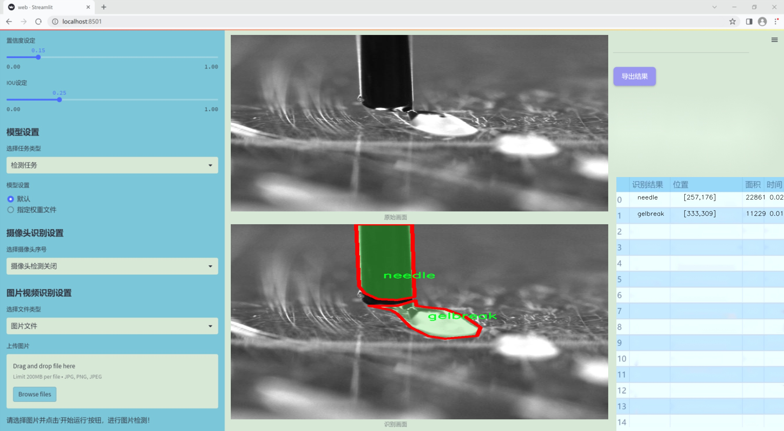
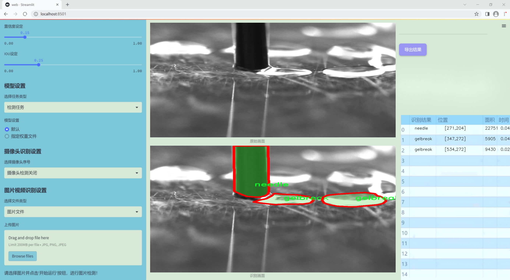
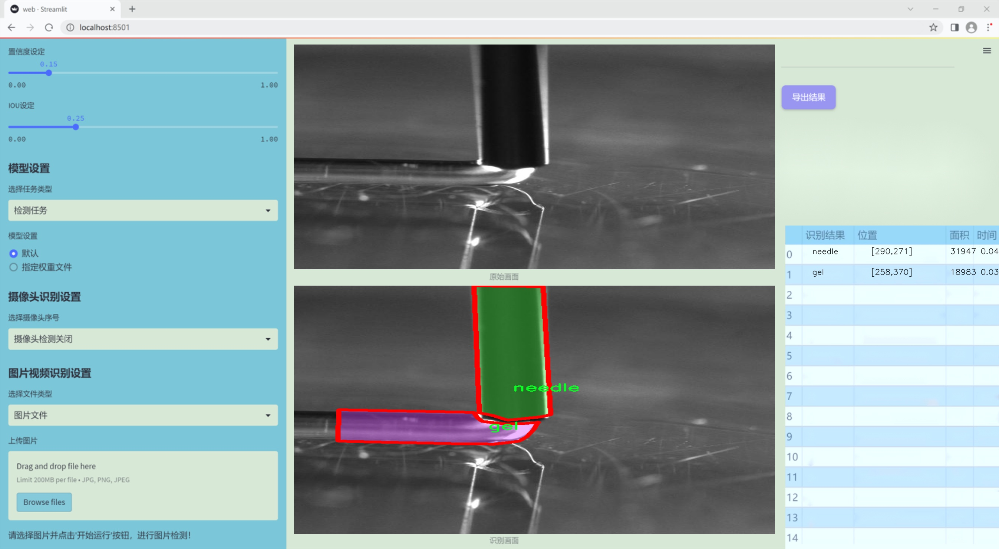
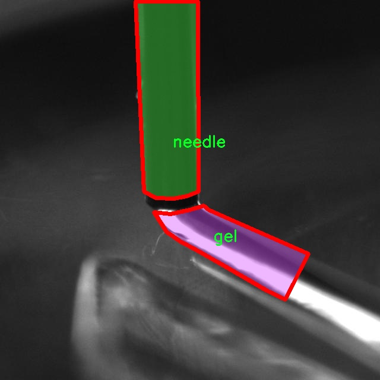
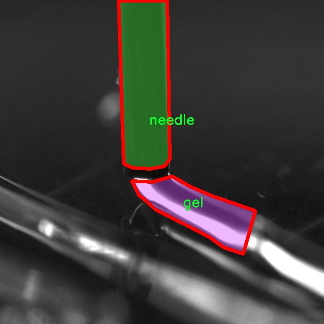
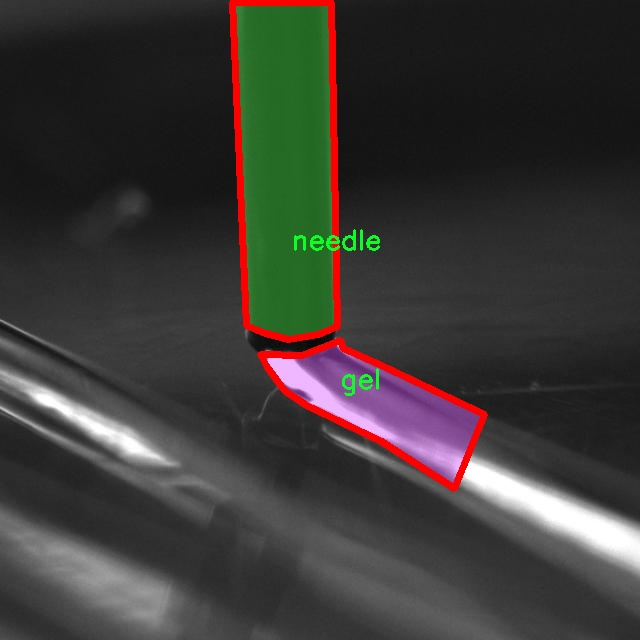
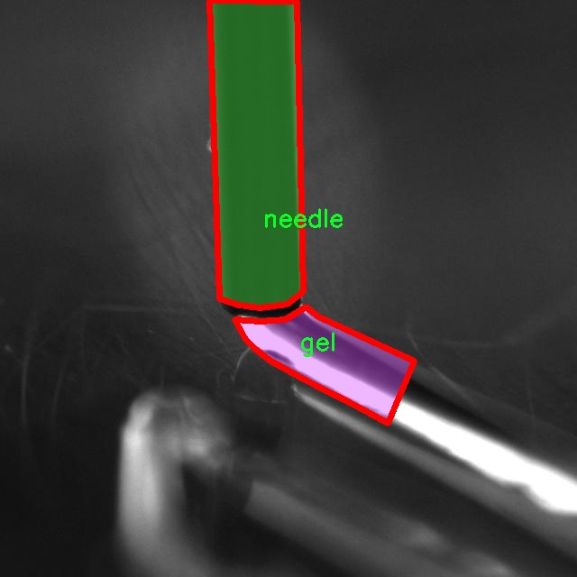
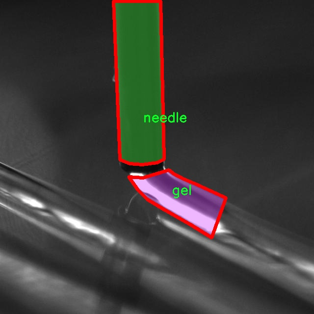

### 1.背景意义

研究背景与意义

随着医疗技术的不断进步，针剂和凝胶的应用日益广泛，尤其是在药物输送和治疗过程中。然而，针剂与凝胶的生产和使用过程中，缺陷的出现可能会对患者的安全和治疗效果产生严重影响。因此，开发一种高效、准确的缺陷检测系统显得尤为重要。传统的人工检测方法不仅耗时耗力，而且容易受到人为因素的影响，导致检测结果的不稳定性和不准确性。因此，基于计算机视觉的自动化检测技术应运而生，成为解决这一问题的有效手段。

本研究旨在基于改进的YOLOv11模型，构建一个针剂与凝胶缺陷检测系统。该系统将利用包含1300张图像的数据集，涵盖三种主要类别：凝胶、凝胶破损和针剂。这些类别的明确划分将有助于模型在训练过程中学习到不同缺陷的特征，从而提高检测的准确性和效率。通过实例分割技术，系统不仅能够识别缺陷的存在，还能精确定位缺陷的具体位置，为后续的质量控制和改进提供重要依据。

在数据集的构建过程中，经过了图像的自动方向调整和统一尺寸处理，确保了数据的一致性和可用性。这一过程为模型的训练提供了良好的基础，使其能够在实际应用中更好地适应不同的场景和条件。此外，采用YOLOv11模型的改进版本，能够在保持高检测精度的同时，显著提高检测速度，满足实时监控的需求。

综上所述，基于改进YOLOv11的针剂与凝胶缺陷检测系统的研究，不仅具有重要的理论意义，也为实际生产中的质量控制提供了切实可行的解决方案。通过该系统的应用，能够有效降低缺陷产品的风险，提高医疗产品的安全性和可靠性，最终为患者的健康保驾护航。

### 2.视频效果

[2.1 视频效果](https://www.bilibili.com/video/BV1MUkFYbEw5/)

### 3.图片效果







##### [项目涉及的源码数据来源链接](https://kdocs.cn/l/cszuIiCKVNis)**

注意：本项目提供训练的数据集和训练教程,由于版本持续更新,暂不提供权重文件（best.pt）,请按照6.训练教程进行训练后实现上图演示的效果。

### 4.数据集信息

##### 4.1 本项目数据集类别数＆类别名

nc: 3
names: ['gel', 'gelbreak', 'needle']


该项目为【图像分割】数据集，请在【训练教程和Web端加载模型教程（第三步）】这一步的时候按照【图像分割】部分的教程来训练

##### 4.2 本项目数据集信息介绍

本项目数据集信息介绍

本项目所使用的数据集旨在支持改进YOLOv11模型在针剂与凝胶缺陷检测系统中的应用，特别聚焦于“needle_gel1”主题。该数据集包含三种主要类别，分别为“gel”、“gelbreak”和“needle”，总类别数量为三。每个类别代表了在实际应用中可能遇到的不同缺陷类型，确保模型能够有效识别和分类各种情况。

在数据集的构建过程中，收集了大量高质量的图像，这些图像涵盖了不同的环境和条件，以增强模型的泛化能力。对于“gel”类别，数据集中包含了各种正常状态下的凝胶图像，确保模型能够学习到标准凝胶的特征。与此同时，“gelbreak”类别则专注于展示凝胶破损或缺陷的情况，提供了多种破损形式的实例，以帮助模型识别潜在的质量问题。最后，“needle”类别则包括了针剂的不同角度和状态的图像，确保模型能够准确检测针剂的存在与完整性。

通过多样化的图像样本和精确的标注，本数据集不仅为YOLOv11模型的训练提供了丰富的素材，还为后续的测试和验证奠定了坚实的基础。数据集的设计考虑到了实际应用中的复杂性，力求在各种条件下都能保持高效的检测性能。随着模型的不断优化和迭代，期望能够在针剂与凝胶缺陷检测领域实现更高的准确率和更低的误报率，为相关行业的质量控制提供强有力的技术支持。











### 5.全套项目环境部署视频教程（零基础手把手教学）

[5.1 所需软件PyCharm和Anaconda安装教程（第一步）](https://www.bilibili.com/video/BV1BoC1YCEKi/?spm_id_from=333.999.0.0&vd_source=bc9aec86d164b67a7004b996143742dc)


[5.2 安装Python虚拟环境创建和依赖库安装视频教程（第二步）](https://www.bilibili.com/video/BV1ZoC1YCEBw?spm_id_from=333.788.videopod.sections&vd_source=bc9aec86d164b67a7004b996143742dc)

### 6.改进YOLOv11训练教程和Web_UI前端加载模型教程（零基础手把手教学）

[6.1 改进YOLOv11训练教程和Web_UI前端加载模型教程（第三步）](https://www.bilibili.com/video/BV1BoC1YCEhR?spm_id_from=333.788.videopod.sections&vd_source=bc9aec86d164b67a7004b996143742dc)


按照上面的训练视频教程链接加载项目提供的数据集，运行train.py即可开始训练



     Epoch   gpu_mem       box       obj       cls    labels  img_size
     1/200     20.8G   0.01576   0.01955  0.007536        22      1280: 100%|██████████| 849/849 [14:42<00:00,  1.04s/it]
               Class     Images     Labels          P          R     mAP@.5 mAP@.5:.95: 100%|██████████| 213/213 [01:14<00:00,  2.87it/s]
                 all       3395      17314      0.994      0.957      0.0957      0.0843

     Epoch   gpu_mem       box       obj       cls    labels  img_size
     2/200     20.8G   0.01578   0.01923  0.007006        22      1280: 100%|██████████| 849/849 [14:44<00:00,  1.04s/it]
               Class     Images     Labels          P          R     mAP@.5 mAP@.5:.95: 100%|██████████| 213/213 [01:12<00:00,  2.95it/s]
                 all       3395      17314      0.996      0.956      0.0957      0.0845

     Epoch   gpu_mem       box       obj       cls    labels  img_size
     3/200     20.8G   0.01561    0.0191  0.006895        27      1280: 100%|██████████| 849/849 [10:56<00:00,  1.29it/s]
               Class     Images     Labels          P          R     mAP@.5 mAP@.5:.95: 100%|███████   | 187/213 [00:52<00:00,  4.04it/s]
                 all       3395      17314      0.996      0.957      0.0957      0.0845


###### [项目数据集下载链接](https://kdocs.cn/l/cszuIiCKVNis)

### 7.原始YOLOv11算法讲解


ultralytics发布了最新的作品YOLOv11，这一次YOLOv11的变化相对于ultralytics公司的上一代作品YOLOv8变化不是很大的（YOLOv9、YOLOv10均不是ultralytics公司作品），其中改变的位置涉及到C2f变为C3K2，在SPPF后面加了一层类似于注意力机制的C2PSA，还有一个变化大家从yaml文件是看不出来的就是它的检测头内部替换了两个DWConv，以及模型的深度和宽度参数进行了大幅度调整，但是在损失函数方面就没有变化还是采用的CIoU作为边界框回归损失，下面带大家深入理解一下ultralytics最新作品YOLOv11的创新点。

**下图为最近的YOLO系列发布时间线！**


* * *

###### YOLOv11和YOLOv8对比

在YOLOYOLOv5，YOLOv8，和YOLOv11是ultralytics公司作品（ultralytics出品必属精品），下面用一张图片从yaml文件来带大家对比一下YOLOv8和YOLOv11的区别，配置文件变得内容比较少大家可以看一卡，左侧为YOLOv8右侧为YOLOv11，不同的点我用黑线标注了出来。


* * *

###### YOLOv11的网络结构解析

下面的图片为YOLOv11的网络结构图。


**其中主要创新点可以总结如下- > **

* * *

1\.
提出C3k2机制，其中C3k2有参数为c3k，其中在网络的浅层c3k设置为False（下图中可以看到c3k2第二个参数被设置为False，就是对应的c3k参数）。


此时所谓的C3k2就相当于YOLOv8中的C2f，其网络结构为一致的，其中的C3k机制的网络结构图如下图所示
**（为什么叫C3k2，我个人理解是因为C3k的调用时C3k其中的参数N固定设置为2的原因，个人理解不一定对** ）。


* * *

2\.
第二个创新点是提出C2PSA机制，这是一个C2（C2f的前身）机制内部嵌入了一个多头注意力机制，在这个过程中我还发现作者尝试了C2fPSA机制但是估计效果不如C2PSA，有的时候机制有没有效果理论上真的很难解释通，下图为C2PSA机制的原理图，仔细观察把Attention哪里去掉则C2PSA机制就变为了C2所以我上面说C2PSA就是C2里面嵌入了一个PSA机制。


* * *

3\.
第三个创新点可以说是原先的解耦头中的分类检测头增加了两个DWConv，具体的对比大家可以看下面两个图下面的是YOLOv11的解耦头，上面的是YOLOv8的解耦头.


我们上面看到了在分类检测头中YOLOv11插入了两个DWConv这样的做法可以大幅度减少参数量和计算量（原先两个普通的Conv大家要注意到卷积和是由3变为了1的，这是形成了两个深度可分离Conv），大家可能不太理解为什么加入了两个DWConv还能够减少计算量，以及什么是深度可分离Conv，下面我来解释一下。

> **`DWConv` 代表 Depthwise
> Convolution（深度卷积）**，是一种在卷积神经网络中常用的高效卷积操作。它主要用于减少计算复杂度和参数量，尤其在移动端或轻量化网络（如
> MobileNet）中十分常见。
>
> **1\. 标准卷积的计算过程**
>
> 在标准卷积操作中，对于一个输入张量（通常是一个多通道的特征图），卷积核的尺寸是 `(h, w, C_in)`，其中 `h` 和 `w`
> 是卷积核的空间尺寸，`C_in`
> 是输入通道的数量。而卷积核与输入张量做的是完整的卷积运算，每个输出通道都与所有输入通道相连并参与卷积操作，导致计算量比较大。
>
> 标准卷积的计算过程是这样的：
>
>   * 每个输出通道是所有输入通道的组合（加权求和），卷积核在每个位置都会计算与所有输入通道的点积。
>   * 假设有 `C_in` 个输入通道和 `C_out` 个输出通道，那么卷积核的总参数量是 `C_in * C_out * h * w`。
>

>
> 2\. **Depthwise Convolution（DWConv）**
>
> 与标准卷积不同， **深度卷积** 将输入的每个通道单独处理，即 **每个通道都有自己的卷积核进行卷积**
> ，不与其他通道进行交互。它可以被看作是标准卷积的一部分，专注于空间维度上的卷积运算。
>
> **深度卷积的计算过程：**
>
>   * 假设输入张量有 `C_in` 个通道，每个通道会使用一个 `h × w`
> 的卷积核进行卷积操作。这个过程称为“深度卷积”，因为每个通道独立进行卷积运算。
>   * 输出的通道数与输入通道数一致，每个输出通道只和对应的输入通道进行卷积，没有跨通道的组合。
>   * 参数量和计算量相比标准卷积大大减少，卷积核的参数量是 `C_in * h * w`。
>

>
> **深度卷积的优点：**
>
>   1. **计算效率高** ：相对于标准卷积，深度卷积显著减少了计算量。它只处理空间维度上的卷积，不再处理通道间的卷积。
>   2.  **参数量减少** ：由于每个卷积核只对单个通道进行卷积，参数量大幅减少。例如，标准卷积的参数量为 `C_in * C_out * h *
> w`，而深度卷积的参数量为 `C_in * h * w`。
>   3.  **结合点卷积可提升效果** ：为了弥补深度卷积缺乏跨通道信息整合的问题，通常深度卷积后会配合 `1x1` 的点卷积（Pointwise
> Convolution）使用，通过 `1x1` 的卷积核整合跨通道的信息。这种组合被称为 **深度可分离卷积** （Depthwise
> Separable Convolution） | **这也是我们本文YOLOv11中的做法** 。
>

>
> 3\. **深度卷积与标准卷积的区别**
>
> 操作类型| 卷积核大小| 输入通道数| 输出通道数| 参数量  
> ---|---|---|---|---  
> 标准卷积| `h × w`| `C_in`| `C_out`| `C_in * C_out * h * w`  
> 深度卷积（DWConv）| `h × w`| `C_in`| `C_in`| `C_in * h * w`  
>  
> 可以看出，深度卷积在相同的卷积核大小下，参数量减少了约 `C_out` 倍
> （细心的人可以发现用最新版本的ultralytics仓库运行YOLOv8参数量相比于之前的YOLOv8以及大幅度减少了这就是因为检测头改了的原因但是名字还是Detect，所以如果你想继续用YOLOv8发表论文做实验那么不要更新最近的ultralytics仓库）。
>
> **4\. 深度可分离卷积 (Depthwise Separable Convolution)**
>
> 深度卷积常与 `1x1` 的点卷积配合使用，这称为深度可分离卷积。其过程如下：
>
>   1. 先对输入张量进行深度卷积，对每个通道独立进行空间卷积。
>   2. 然后通过 `1x1` 点卷积，对通道维度进行混合，整合不同通道的信息。
>

>
> 这样既可以保证计算量的减少，又可以保持跨通道的信息流动。
>
> 5\. **总结**
>
> `DWConv` 是一种高效的卷积方式，通过单独处理每个通道来减少计算量，结合 `1x1`
> 的点卷积，形成深度可分离卷积，可以在保持网络性能的同时极大地减少模型的计算复杂度和参数量。

**看到这里大家应该明白了为什么加入了两个DWConv还能减少参数量以及YOLOv11的检测头创新点在哪里。**

* * *

##### YOLOv11和YOLOv8还有一个不同的点就是其各个版本的模型（N - S - M- L - X）网络深度和宽度变了


可以看到在深度（depth）和宽度
（width）两个地方YOLOv8和YOLOv11是基本上完全不同了，这里我理解这么做的含义就是模型网络变小了，所以需要加深一些模型的放缩倍数来弥补模型之前丧失的能力从而来达到一个平衡。

> **本章总结：**
> YOLOv11的改进点其实并不多更多的都是一些小的结构上的创新，相对于之前的YOLOv5到YOLOv8的创新，其实YOLOv11的创新点不算多，但是其是ultralytics公司的出品，同时ultralytics仓库的使用量是非常多的（不像YOLOv9和YOLOv10）所以在未来的很长一段时间内其实YOLO系列估计不会再更新了，YOLOv11作为最新的SOTA肯定是十分适合大家来发表论文和创新的。
>

### 8.200+种全套改进YOLOV11创新点原理讲解

#### 8.1 200+种全套改进YOLOV11创新点原理讲解大全

由于篇幅限制，每个创新点的具体原理讲解就不全部展开，具体见下列网址中的改进模块对应项目的技术原理博客网址【Blog】（创新点均为模块化搭建，原理适配YOLOv5~YOLOv11等各种版本）

[改进模块技术原理博客【Blog】网址链接](https://gitee.com/qunmasj/good)


#### 8.2 精选部分改进YOLOV11创新点原理讲解

###### 这里节选部分改进创新点展开原理讲解(完整的改进原理见上图和[改进模块技术原理博客链接](https://gitee.com/qunmasj/good)【如果此小节的图加载失败可以通过CSDN或者Github搜索该博客的标题访问原始博客，原始博客图片显示正常】


### LSKNet的架构
该博客提出的结构层级依次为：

LSK module（大核卷积序列+空间选择机制） < LSK Block （LK Selection + FFN）<LSKNet（N个LSK Block）


#### LSK 模块

LSK Block
LSKNet 是主干网络中的一个可重复堆叠的块（Block），每个LSK Block包括两个残差子块，即大核选择子块（Large Kernel Selection，LK Selection）和前馈网络子块（Feed-forward Network ，FFN），如图8。LK Selection子块根据需要动态地调整网络的感受野，FFN子块用于通道混合和特征细化，由一个全连接层、一个深度卷积、一个 GELU 激活和第二个全连接层组成。

LSK module（LSK 模块，图4）由一个大核卷积序列（large kernel convolutions）和一个空间核选择机制（spatial kernel selection mechanism）组成，被嵌入到了LSK Block 的 LK Selection子块中。

#### Large Kernel Convolutions
因为不同类型的目标对背景信息的需求不同，这就需要模型能够自适应选择不同大小的背景范围。因此，作者通过解耦出一系列具有大卷积核、且不断扩张的Depth-wise 卷积，构建了一个更大感受野的网络。

具体地，假设序列中第i个Depth-wise 卷积核的大小为 ，扩张率为 d，感受野为 ，它们满足以下关系：


卷积核大小和扩张率的增加保证了感受野能够快速增大。此外，我们设置了扩张率的上限，以保证扩张卷积不会引入特征图之间的差距。


Table2的卷积核大小可根据公式（1）和（2）计算，详见下图：


这样设计的好处有两点。首先，能够产生具有多种不同大小感受野的特征，便于后续的核选择；第二，序列解耦比简单的使用一个大型卷积核效果更好。如上图表2所示，解耦操作相对于标准的大型卷积核，有效地将低了模型的参数量。

为了从输入数据  的不同区域获取丰富的背景信息特征，可采用一系列解耦的、不用感受野的Depth-wise 卷积核：


其中，是卷积核为 、扩张率为  的Depth-wise 卷积操作。假设有个解耦的卷积核，每个卷积操作后又要经过一个的卷积层进行空间特征向量的通道融合。


之后，针对不同的目标，可基于获取的多尺度特征，通过下文中的选择机制动态选择合适的卷积核大小。

这一段的意思可以简单理解为：

把一个大的卷积核拆成了几个小的卷积核，比如一个大小为5，扩张率为1的卷积核加上一个大小为7，扩张率为3的卷积核，感受野为23，与一个大小为23，扩张率为1的卷积核的感受野是一样的。因此可用两个小的卷积核替代一个大的卷积核，同理一个大小为29的卷积核也可以用三个小的卷积代替（Table 2），这样可以有效的减少参数，且更灵活。

将输入数据依次通过这些小的卷积核（公式3），并在每个小的卷积核后面接上一个1×1的卷积进行通道融合（公式4）。

#### Spatial Kernel Selection
为了使模型更关注目标在空间上的重点背景信息，作者使用空间选择机制从不同尺度的大卷积核中对特征图进行空间选择。

首先，将来自于不同感受野卷积核的特征进行concate拼接，然后，应用通道级的平均池化和最大池化提取空间关系，其中， 和  是平均池化和最大池化后的空间特征描述符。为了实现不同空间描述符的信息交互，作者利用卷积层将空间池化特征进行拼接，将2个通道的池化特征转换为N个空间注意力特征图，之后，将Sigmoid激活函数应用到每一个空间注意力特征图，可获得每个解耦的大卷积核所对应的独立的空间选择掩膜，又然后，将解耦后的大卷积核序列的特征与对应的空间选择掩膜进行加权处理，并通过卷积层进行融合获得注意力特征 ，最后LSK module的输出可通过输入特征  与注意力特征  的逐元素点成获得，公式对应于结构图上的操作如下：


### 9.系统功能展示

图9.1.系统支持检测结果表格显示

  图9.2.系统支持置信度和IOU阈值手动调节

  图9.3.系统支持自定义加载权重文件best.pt(需要你通过步骤5中训练获得)

  图9.4.系统支持摄像头实时识别

  图9.5.系统支持图片识别

  图9.6.系统支持视频识别

  图9.7.系统支持识别结果文件自动保存

  图9.8.系统支持Excel导出检测结果数据


### 10. YOLOv11核心改进源码讲解

#### 10.1 test_selective_scan.py

以下是对您提供的代码进行的核心部分提取和详细中文注释：

```python
import torch
import torch.nn.functional as F

def build_selective_scan_fn(selective_scan_cuda: object = None, mode="mamba_ssm", tag=None):
    """
    构建选择性扫描函数的工厂函数，根据给定的CUDA实现和模式返回相应的选择性扫描函数。
    """
    class SelectiveScanFn(torch.autograd.Function):
        @staticmethod
        def forward(ctx, u, delta, A, B, C, D=None, z=None, delta_bias=None, delta_softplus=False, return_last_state=False, nrows=1, backnrows=-1):
            """
            前向传播函数，执行选择性扫描操作。
            参数:
                ctx: 上下文对象，用于保存状态以供反向传播使用。
                u: 输入张量。
                delta: 增量张量。
                A, B, C: 参与计算的参数张量。
                D: 可选的额外参数张量。
                z: 可选的张量，用于控制输出。
                delta_bias: 可选的增量偏置。
                delta_softplus: 是否使用softplus激活。
                return_last_state: 是否返回最后状态。
                nrows: 每次扫描的行数。
                backnrows: 反向传播时的行数。
            返回:
                输出张量或输出和最后状态的元组。
            """
            # 确保输入张量是连续的
            if u.stride(-1) != 1:
                u = u.contiguous()
            if delta.stride(-1) != 1:
                delta = delta.contiguous()
            if D is not None:
                D = D.contiguous()
            if B.stride(-1) != 1:
                B = B.contiguous()
            if C.stride(-1) != 1:
                C = C.contiguous()
            if z is not None and z.stride(-1) != 1:
                z = z.contiguous()

            # 调整张量维度
            if B.dim() == 3:
                B = rearrange(B, "b dstate l -> b 1 dstate l")
                ctx.squeeze_B = True
            if C.dim() == 3:
                C = rearrange(C, "b dstate l -> b 1 dstate l")
                ctx.squeeze_C = True

            # 检查输入的形状和维度
            assert u.shape[1] % (B.shape[1] * nrows) == 0 
            assert nrows in [1, 2, 3, 4]

            # 调用CUDA实现的前向函数
            out, x, *rest = selective_scan_cuda.fwd(u, delta, A, B, C, D, z, delta_bias, delta_softplus)

            # 保存状态以供反向传播
            ctx.save_for_backward(u, delta, A, B, C, D, delta_bias, x)

            last_state = x[:, :, -1, 1::2]  # 获取最后状态
            return out if not return_last_state else (out, last_state)

        @staticmethod
        def backward(ctx, dout):
            """
            反向传播函数，计算梯度。
            参数:
                ctx: 上下文对象，包含前向传播时保存的状态。
                dout: 输出的梯度。
            返回:
                输入张量的梯度。
            """
            u, delta, A, B, C, D, delta_bias, x = ctx.saved_tensors
            
            # 调用CUDA实现的反向函数
            du, ddelta, dA, dB, dC, dD, ddelta_bias, *rest = selective_scan_cuda.bwd(
                u, delta, A, B, C, D, delta_bias, dout, x, None, False
            )

            return (du, ddelta, dA, dB, dC, dD if D is not None else None, ddelta_bias if delta_bias is not None else None)

    def selective_scan_fn(u, delta, A, B, C, D=None, z=None, delta_bias=None, delta_softplus=False, return_last_state=False, nrows=1, backnrows=-1):
        """
        封装选择性扫描函数，调用前向传播实现。
        """
        return SelectiveScanFn.apply(u, delta, A, B, C, D, z, delta_bias, delta_softplus, return_last_state, nrows, backnrows)

    return selective_scan_fn

# 选择性扫描的参考实现
def selective_scan_ref(u, delta, A, B, C, D=None, z=None, delta_bias=None, delta_softplus=False, return_last_state=False):
    """
    选择性扫描的参考实现，用于验证CUDA实现的正确性。
    """
    # 处理输入数据类型
    dtype_in = u.dtype
    u = u.float()
    delta = delta.float()
    if delta_bias is not None:
        delta = delta + delta_bias[..., None].float()
    if delta_softplus:
        delta = F.softplus(delta)

    # 初始化状态
    batch, dim, dstate = u.shape[0], A.shape[0], A.shape[1]
    x = A.new_zeros((batch, dim, dstate))
    ys = []

    # 计算增量
    deltaA = torch.exp(torch.einsum('bdl,dn->bdln', delta, A))
    deltaB_u = torch.einsum('bdl,dn,bdl->bdln', delta, B, u)

    last_state = None
    for i in range(u.shape[2]):
        x = deltaA[:, :, i] * x + deltaB_u[:, :, i]
        y = torch.einsum('bdn,dn->bd', x, C)
        if i == u.shape[2] - 1:
            last_state = x
        ys.append(y)

    y = torch.stack(ys, dim=2)  # (batch dim L)
    out = y if D is None else y + u * rearrange(D, "d -> d 1")
    if z is not None:
        out = out * F.silu(z)
    out = out.to(dtype=dtype_in)
    return out if not return_last_state else (out, last_state)

# 选择性扫描函数的初始化
MODE = "mamba_ssm_ssoflex"  # 选择模式
if MODE == "mamba_ssm":
    import selective_scan_cuda
    selective_scan_fn = build_selective_scan_fn(selective_scan_cuda, mode=MODE)
elif MODE == "ssoflex":
    import selective_scan_cuda_oflex
    selective_scan_fn = build_selective_scan_fn(selective_scan_cuda_oflex, mode=MODE)
# 其他模式的初始化省略...

print("use MODE:", MODE)
```

### 代码核心部分解释：
1. **`build_selective_scan_fn`**: 这是一个工厂函数，用于构建选择性扫描的前向和反向传播函数。它接受一个CUDA实现和模式参数，返回一个可以用于计算的函数。

2. **`SelectiveScanFn`**: 这是一个自定义的PyTorch自动求导函数，包含前向和反向传播的实现。前向传播计算选择性扫描的输出，反向传播计算梯度。

3. **`selective_scan_ref`**: 这是选择性扫描的参考实现，用于验证CUDA实现的正确性。它通过逐步计算来实现选择性扫描的逻辑。

4. **模式选择**: 根据不同的模式导入相应的CUDA实现，并构建选择性扫描函数。

这些核心部分构成了选择性扫描的基础逻辑，能够在深度学习模型中进行高效的计算。

这个文件 `test_selective_scan.py` 是一个用于测试选择性扫描（Selective Scan）功能的 PyTorch 实现。代码的主要部分包括选择性扫描的前向和反向传播函数的定义，以及一系列的测试用例。

首先，文件导入了一些必要的库，包括 `torch`、`torch.nn.functional`、`pytest` 和 `einops`。这些库提供了张量操作、自动求导和重排功能。

接下来，定义了一个 `build_selective_scan_fn` 函数，它接收一个 CUDA 实现的选择性扫描函数和一些其他参数，返回一个 PyTorch 的自定义函数 `SelectiveScanFn`。这个自定义函数继承自 `torch.autograd.Function`，实现了前向传播和反向传播的逻辑。

在 `SelectiveScanFn` 的 `forward` 方法中，首先对输入的张量进行连续性检查，并根据需要调整其形状。然后根据不同的模式（如 "mamba_ssm"、"ssoflex" 等）调用相应的 CUDA 实现进行前向计算。计算完成后，保存输入张量以备反向传播使用，并返回输出结果。

`backward` 方法则实现了反向传播的逻辑。它从上下文中恢复保存的张量，并根据选择的模式调用相应的 CUDA 实现进行梯度计算。最后，返回各个输入张量的梯度。

文件中还定义了两个参考实现 `selective_scan_ref` 和 `selective_scan_ref_v2`，它们是选择性扫描的 CPU 实现，用于在测试中与 CUDA 实现的结果进行比较。这两个函数的参数与 `selective_scan_fn` 相同，计算逻辑相似，但在 CPU 上执行。

在文件的最后部分，定义了一些测试参数和测试函数 `test_selective_scan`。这个测试函数使用 `pytest` 的参数化功能，生成不同的输入配置来测试选择性扫描的实现。它会生成随机输入张量，并调用选择性扫描的 CUDA 实现和参考实现，比较它们的输出和梯度是否一致。

整个文件的结构清晰，功能模块化，便于维护和扩展。通过这种方式，可以确保选择性扫描的实现正确性和性能。

#### 10.2 fasternet.py

以下是经过简化和注释的核心代码部分：

```python
import torch
import torch.nn as nn
from typing import List
from torch import Tensor

class Partial_conv3(nn.Module):
    """部分卷积层，用于在训练和推理时处理输入张量。"""

    def __init__(self, dim, n_div, forward):
        super().__init__()
        self.dim_conv3 = dim // n_div  # 部分卷积的通道数
        self.dim_untouched = dim - self.dim_conv3  # 未被卷积处理的通道数
        self.partial_conv3 = nn.Conv2d(self.dim_conv3, self.dim_conv3, 3, 1, 1, bias=False)  # 定义卷积层

        # 根据前向传播方式选择不同的前向函数
        if forward == 'slicing':
            self.forward = self.forward_slicing
        elif forward == 'split_cat':
            self.forward = self.forward_split_cat
        else:
            raise NotImplementedError

    def forward_slicing(self, x: Tensor) -> Tensor:
        """推理时的前向传播，仅处理部分通道。"""
        x = x.clone()  # 保持原始输入不变以便后续残差连接
        x[:, :self.dim_conv3, :, :] = self.partial_conv3(x[:, :self.dim_conv3, :, :])  # 处理部分通道
        return x

    def forward_split_cat(self, x: Tensor) -> Tensor:
        """训练和推理时的前向传播，处理输入并拼接未处理的部分。"""
        x1, x2 = torch.split(x, [self.dim_conv3, self.dim_untouched], dim=1)  # 分割输入
        x1 = self.partial_conv3(x1)  # 处理部分通道
        x = torch.cat((x1, x2), 1)  # 拼接处理后的部分和未处理的部分
        return x


class MLPBlock(nn.Module):
    """多层感知机模块，包含卷积、归一化和激活函数。"""

    def __init__(self, dim, n_div, mlp_ratio, drop_path, layer_scale_init_value, act_layer, norm_layer, pconv_fw_type):
        super().__init__()
        self.dim = dim
        self.mlp_ratio = mlp_ratio
        self.drop_path = nn.Identity() if drop_path <= 0 else nn.Dropout(drop_path)  # 随机丢弃路径
        self.n_div = n_div

        mlp_hidden_dim = int(dim * mlp_ratio)  # MLP隐藏层维度

        # 定义MLP层
        mlp_layer: List[nn.Module] = [
            nn.Conv2d(dim, mlp_hidden_dim, 1, bias=False),
            norm_layer(mlp_hidden_dim),
            act_layer(),
            nn.Conv2d(mlp_hidden_dim, dim, 1, bias=False)
        ]
        self.mlp = nn.Sequential(*mlp_layer)  # 将MLP层组合成序列

        # 定义空间混合层
        self.spatial_mixing = Partial_conv3(dim, n_div, pconv_fw_type)

    def forward(self, x: Tensor) -> Tensor:
        """前向传播，包含残差连接。"""
        shortcut = x  # 保存输入以便后续残差连接
        x = self.spatial_mixing(x)  # 进行空间混合
        x = shortcut + self.drop_path(self.mlp(x))  # 残差连接
        return x


class FasterNet(nn.Module):
    """FasterNet模型，包含多个阶段和模块。"""

    def __init__(self, in_chans=3, num_classes=1000, embed_dim=96, depths=(1, 2, 8, 2), mlp_ratio=2., n_div=4,
                 patch_size=4, patch_stride=4, drop_path_rate=0.1, norm_layer=nn.BatchNorm2d, act_layer=nn.ReLU):
        super().__init__()

        self.num_stages = len(depths)  # 模型阶段数
        self.embed_dim = embed_dim  # 嵌入维度

        # 定义图像分块层
        self.patch_embed = nn.Conv2d(in_chans, embed_dim, kernel_size=patch_size, stride=patch_stride, bias=False)

        # 构建各个阶段
        stages_list = []
        for i_stage in range(self.num_stages):
            stage = BasicStage(dim=int(embed_dim * 2 ** i_stage), n_div=n_div, depth=depths[i_stage],
                               mlp_ratio=mlp_ratio, drop_path=drop_path_rate)
            stages_list.append(stage)

        self.stages = nn.Sequential(*stages_list)  # 将所有阶段组合成序列

    def forward(self, x: Tensor) -> Tensor:
        """前向传播，输出各个阶段的特征。"""
        x = self.patch_embed(x)  # 进行图像分块
        outs = []
        for stage in self.stages:
            x = stage(x)  # 通过每个阶段
            outs.append(x)  # 保存输出
        return outs  # 返回所有阶段的输出


# 示例：创建FasterNet模型并进行前向传播
if __name__ == '__main__':
    model = FasterNet()  # 创建FasterNet模型
    inputs = torch.randn((1, 3, 640, 640))  # 创建随机输入
    outputs = model(inputs)  # 前向传播
    for output in outputs:
        print(output.size())  # 打印每个阶段的输出尺寸
```

### 代码说明：
1. **Partial_conv3**：实现了部分卷积的功能，可以选择在推理或训练时使用不同的前向传播方式。
2. **MLPBlock**：实现了多层感知机模块，包含卷积、归一化和激活函数，并支持残差连接。
3. **FasterNet**：构建了一个多阶段的网络模型，包含图像分块和多个基本阶段的组合。前向传播时返回各个阶段的特征。
4. **主程序**：创建了一个FasterNet模型并进行了前向传播，输出各个阶段的特征尺寸。

这个程序文件 `fasternet.py` 实现了一个名为 FasterNet 的深度学习模型，主要用于图像处理任务。文件中包含了多个类和函数，构成了整个模型的结构和功能。

首先，程序导入了必要的库，包括 PyTorch 和一些用于构建神经网络的模块。接着，定义了一些辅助类，比如 `Partial_conv3`、`MLPBlock`、`BasicStage`、`PatchEmbed` 和 `PatchMerging`，这些类负责构建模型的不同部分。

`Partial_conv3` 类实现了一个部分卷积层，可以选择不同的前向传播方式（切片或拼接），用于处理输入特征图。`MLPBlock` 类则是一个多层感知机模块，包含了卷积层、归一化层和激活函数，支持残差连接和可选的层级缩放。`BasicStage` 类则是由多个 `MLPBlock` 组成的一个阶段，负责对输入进行处理。

`PatchEmbed` 类用于将输入图像分割成不重叠的补丁，并通过卷积将其嵌入到更高维的特征空间中。`PatchMerging` 类则在不同阶段之间进行特征图的合并，减少特征图的空间维度。

`FasterNet` 类是整个模型的核心，负责初始化模型的各个组件，包括补丁嵌入、多个基本阶段和输出归一化层。模型的前向传播方法会依次通过这些组件，并在指定的输出层处返回特征图。

文件中还定义了一些函数，如 `update_weight` 用于更新模型的权重，`fasternet_t0`、`fasternet_t1`、`fasternet_t2` 等函数用于加载不同配置的 FasterNet 模型。这些函数会读取 YAML 配置文件，初始化模型，并在提供权重文件时加载预训练权重。

最后，在文件的主程序部分，示例代码展示了如何创建一个 FasterNet 模型实例，并对输入进行前向传播，输出各个阶段的特征图尺寸。

总体而言，这个程序文件实现了一个灵活且高效的深度学习模型，适用于图像分类、目标检测等任务，具有良好的可扩展性和可配置性。

#### 10.3 kagn_conv.py

以下是代码中最核心的部分，并附上详细的中文注释：

```python
import torch
import torch.nn as nn
from functools import lru_cache

class KAGNConvNDLayer(nn.Module):
    def __init__(self, conv_class, norm_class, conv_w_fun, input_dim, output_dim, degree, kernel_size,
                 groups=1, padding=0, stride=1, dilation=1, dropout: float = 0.0, ndim: int = 2):
        super(KAGNConvNDLayer, self).__init__()
        
        # 初始化参数
        self.inputdim = input_dim  # 输入维度
        self.outdim = output_dim    # 输出维度
        self.degree = degree         # 多项式的阶数
        self.kernel_size = kernel_size  # 卷积核大小
        self.padding = padding       # 填充
        self.stride = stride         # 步幅
        self.dilation = dilation     # 膨胀
        self.groups = groups         # 分组卷积的组数
        self.base_activation = nn.SiLU()  # 基础激活函数
        self.conv_w_fun = conv_w_fun  # 卷积权重函数
        self.ndim = ndim             # 数据的维度（1D, 2D, 3D）
        self.dropout = None          # Dropout层

        # 如果设置了dropout，则根据维度选择对应的Dropout层
        if dropout > 0:
            if ndim == 1:
                self.dropout = nn.Dropout1d(p=dropout)
            elif ndim == 2:
                self.dropout = nn.Dropout2d(p=dropout)
            elif ndim == 3:
                self.dropout = nn.Dropout3d(p=dropout)

        # 验证输入和输出维度的有效性
        if groups <= 0:
            raise ValueError('groups must be a positive integer')
        if input_dim % groups != 0:
            raise ValueError('input_dim must be divisible by groups')
        if output_dim % groups != 0:
            raise ValueError('output_dim must be divisible by groups')

        # 创建基础卷积层和归一化层
        self.base_conv = nn.ModuleList([conv_class(input_dim // groups,
                                                   output_dim // groups,
                                                   kernel_size,
                                                   stride,
                                                   padding,
                                                   dilation,
                                                   groups=1,
                                                   bias=False) for _ in range(groups)])

        self.layer_norm = nn.ModuleList([norm_class(output_dim // groups) for _ in range(groups)])

        # 初始化多项式权重
        poly_shape = (groups, output_dim // groups, (input_dim // groups) * (degree + 1)) + tuple(
            kernel_size for _ in range(ndim))

        self.poly_weights = nn.Parameter(torch.randn(*poly_shape))  # 多项式权重
        self.beta_weights = nn.Parameter(torch.zeros(degree + 1, dtype=torch.float32))  # beta权重

        # 使用Kaiming均匀分布初始化卷积层权重
        for conv_layer in self.base_conv:
            nn.init.kaiming_uniform_(conv_layer.weight, nonlinearity='linear')

        nn.init.kaiming_uniform_(self.poly_weights, nonlinearity='linear')
        nn.init.normal_(
            self.beta_weights,
            mean=0.0,
            std=1.0 / ((kernel_size ** ndim) * self.inputdim * (self.degree + 1.0)),
        )

    def beta(self, n, m):
        # 计算beta值
        return (
            ((m + n) * (m - n) * n ** 2) / (m ** 2 / (4.0 * n ** 2 - 1.0))
        ) * self.beta_weights[n]

    @lru_cache(maxsize=128)  # 使用缓存避免重复计算Legendre多项式
    def gram_poly(self, x, degree):
        # 计算Legendre多项式
        p0 = x.new_ones(x.size())  # p0初始化为1

        if degree == 0:
            return p0.unsqueeze(-1)

        p1 = x  # p1初始化为x
        grams_basis = [p0, p1]  # 存储多项式基

        for i in range(2, degree + 1):
            p2 = x * p1 - self.beta(i - 1, i) * p0  # 递归计算多项式
            grams_basis.append(p2)
            p0, p1 = p1, p2  # 更新p0和p1

        return torch.cat(grams_basis, dim=1)  # 将多项式基连接在一起

    def forward_kag(self, x, group_index):
        # 前向传播函数
        basis = self.base_conv[group_index](self.base_activation(x))  # 基础卷积层的输出

        # 将x归一化到[-1, 1]范围内以稳定Legendre多项式计算
        x = torch.tanh(x).contiguous()

        if self.dropout is not None:
            x = self.dropout(x)  # 应用Dropout

        grams_basis = self.base_activation(self.gram_poly(x, self.degree))  # 计算Gram多项式基
        y = self.conv_w_fun(grams_basis, self.poly_weights[group_index],
                            stride=self.stride, dilation=self.dilation,
                            padding=self.padding, groups=1)  # 计算卷积输出

        y = self.base_activation(self.layer_norm[group_index](y + basis))  # 归一化并激活

        return y

    def forward(self, x):
        # 整体前向传播
        split_x = torch.split(x, self.inputdim // self.groups, dim=1)  # 按组分割输入
        output = []
        for group_ind, _x in enumerate(split_x):
            y = self.forward_kag(_x.clone(), group_ind)  # 对每个组进行前向传播
            output.append(y.clone())
        y = torch.cat(output, dim=1)  # 将输出连接在一起
        return y
```

### 代码说明：
1. **KAGNConvNDLayer类**：这是一个自定义的卷积层，支持多维卷积（1D、2D、3D），使用Legendre多项式进行特征提取。
2. **初始化方法**：设置输入输出维度、卷积参数、激活函数、Dropout等，并初始化卷积层和归一化层。
3. **beta方法**：计算多项式的beta值，用于Legendre多项式的计算。
4. **gram_poly方法**：计算Legendre多项式的基，使用递归方式生成多项式。
5. **forward_kag方法**：执行前向传播，计算卷积输出并进行激活和归一化。
6. **forward方法**：对输入进行分组处理，调用`forward_kag`进行计算，并将结果合并。

这个程序文件定义了一个名为 `kagn_conv.py` 的深度学习模块，主要用于实现一种新的卷积层，称为 KAGN（Kochawongwat的自适应卷积层）。该模块利用了多项式基函数（Legendre多项式）来增强卷积操作的表达能力，适用于不同维度的输入数据（1D、2D、3D）。

首先，程序导入了必要的库，包括 `torch` 和 `torch.nn`，以及用于卷积操作的函数。接着，定义了一个基类 `KAGNConvNDLayer`，它继承自 `nn.Module`。在初始化方法中，传入了多个参数，包括输入和输出维度、卷积核大小、分组数、填充、步幅、扩张率、丢弃率等。该类还定义了基础激活函数（使用 SiLU 激活函数），并根据输入的维度选择相应的丢弃层。

在初始化过程中，程序会检查分组数是否为正整数，并确保输入和输出维度能够被分组数整除。接着，创建了多个卷积层和归一化层的模块列表，并初始化多项式权重和 beta 权重，使用 Kaiming 均匀分布进行初始化，以提高训练的起始效果。

该类中还定义了一个 `beta` 方法，用于计算与 Legendre 多项式相关的权重，以及一个 `gram_poly` 方法，用于计算给定输入和多项式阶数的 Legendre 多项式。`gram_poly` 方法使用了缓存机制，以避免重复计算。

`forward_kag` 方法是该类的核心部分，首先对输入应用基础激活函数，然后进行线性变换。接着，将输入标准化到 [-1, 1] 的范围内，以便于计算 Legendre 多项式。然后，调用 `gram_poly` 方法计算多项式基，并通过自定义的卷积函数进行卷积操作，最后应用归一化和激活函数。

`forward` 方法则是整个模块的前向传播过程，它将输入数据按照分组进行拆分，并对每个分组调用 `forward_kag` 方法进行处理，最后将所有输出拼接在一起。

此外，程序还定义了三个子类：`KAGNConv3DLayer`、`KAGNConv2DLayer` 和 `KAGNConv1DLayer`，分别用于处理三维、二维和一维的卷积操作。这些子类通过调用基类的构造函数，传入相应的卷积层和归一化层，简化了不同维度卷积层的实现。

总体来说，这个程序文件实现了一种灵活且功能强大的卷积层，能够在不同维度上进行有效的特征提取，适用于各种深度学习任务。

#### 10.4 UniRepLKNet.py

以下是代码中最核心的部分，并附上详细的中文注释：

```python
import torch
import torch.nn as nn
import torch.nn.functional as F

class GRNwithNHWC(nn.Module):
    """ GRN (全局响应归一化) 层
    该层最初在 ConvNeXt V2 中提出。该实现比原始实现更高效。
    假设输入的形状为 (N, H, W, C)
    """
    def __init__(self, dim, use_bias=True):
        super().__init__()
        self.use_bias = use_bias
        # gamma 和 beta 是可学习的参数
        self.gamma = nn.Parameter(torch.zeros(1, 1, 1, dim))
        if self.use_bias:
            self.beta = nn.Parameter(torch.zeros(1, 1, 1, dim))

    def forward(self, x):
        # 计算输入 x 的 L2 范数
        Gx = torch.norm(x, p=2, dim=(1, 2), keepdim=True)
        # 归一化
        Nx = Gx / (Gx.mean(dim=-1, keepdim=True) + 1e-6)
        if self.use_bias:
            return (self.gamma * Nx + 1) * x + self.beta
        else:
            return (self.gamma * Nx + 1) * x

class UniRepLKNetBlock(nn.Module):
    """ UniRepLKNet 的基本模块
    该模块包含深度卷积、归一化、Squeeze-and-Excitation (SE) 机制和前馈网络
    """
    def __init__(self, dim, kernel_size, drop_path=0., deploy=False, use_sync_bn=False):
        super().__init__()
        # 深度卷积层
        self.dwconv = nn.Conv2d(dim, dim, kernel_size=kernel_size, stride=1, padding=kernel_size // 2, groups=dim)
        # 归一化层
        self.norm = nn.BatchNorm2d(dim) if not deploy else nn.Identity()
        # Squeeze-and-Excitation Block
        self.se = SEBlock(dim, dim // 4)
        # 前馈网络
        self.pwconv1 = nn.Linear(dim, dim * 4)
        self.pwconv2 = nn.Linear(dim * 4, dim)
        self.act = nn.GELU()

    def forward(self, inputs):
        # 先经过深度卷积和归一化
        y = self.se(self.norm(self.dwconv(inputs)))
        # 然后经过前馈网络
        y = self.pwconv2(self.act(self.pwconv1(y)))
        return y + inputs  # 残差连接

class UniRepLKNet(nn.Module):
    """ UniRepLKNet 模型
    该模型由多个 UniRepLKNetBlock 组成，支持多种输入和输出设置
    """
    def __init__(self, in_chans=3, num_classes=1000, depths=(3, 3, 27, 3), dims=(96, 192, 384, 768)):
        super().__init__()
        self.stages = nn.ModuleList()
        for i in range(len(depths)):
            # 每个阶段包含多个 UniRepLKNetBlock
            stage = nn.Sequential(*[UniRepLKNetBlock(dim=dims[i], kernel_size=3) for _ in range(depths[i])])
            self.stages.append(stage)

    def forward(self, x):
        # 逐阶段处理输入
        for stage in self.stages:
            x = stage(x)
        return x

# 实例化模型并进行前向传播
if __name__ == '__main__':
    inputs = torch.randn((1, 3, 640, 640))  # 随机输入
    model = UniRepLKNet()  # 创建模型实例
    res = model(inputs)  # 前向传播
    print(res.shape)  # 输出结果的形状
```

### 代码说明：
1. **GRNwithNHWC**: 实现了全局响应归一化层，用于增强特征的表达能力。
2. **UniRepLKNetBlock**: 是模型的基本构建块，包含深度卷积、归一化、Squeeze-and-Excitation 机制和前馈网络，支持残差连接。
3. **UniRepLKNet**: 是整个模型的实现，包含多个 `UniRepLKNetBlock`，用于处理输入并生成输出。

### 主要功能：
- 该模型旨在进行多种类型的数据处理，包括图像、音频、视频等。
- 通过深度卷积和归一化等技术，增强了模型的特征提取能力。
- 支持残差连接，有助于缓解深层网络的训练难度。

这个程序文件实现了一个名为UniRepLKNet的深度学习模型，主要用于音频、视频、点云、时间序列和图像识别。该模型的设计灵感来源于多个现有的模型架构，包括RepLKNet、ConvNeXt、DINO和DeiT等。文件中包含了多个类和函数，构成了模型的核心结构。

首先，文件导入了必要的PyTorch库和一些工具函数。接着定义了一些基本的模块，比如GRN（全局响应归一化）层、NCHW与NHWC格式的转换层等。这些模块在后续的网络结构中会被频繁使用。

在模型的构建中，使用了一个名为`get_conv2d`的函数来决定使用哪种卷积实现，支持原生卷积和高效的iGEMM大核卷积实现。这个函数根据输入的参数（如卷积核大小、步幅等）来选择合适的卷积层。

`UniRepLKNetBlock`类是模型的基本构建块，它结合了深度卷积、归一化、激活函数和Squeeze-and-Excitation（SE）模块。该类支持可选的深度可分离卷积和层级缩放初始化值，并且在前向传播时可以选择使用检查点来节省内存。

`UniRepLKNet`类是整个模型的核心，定义了模型的输入通道数、类别数、每个阶段的深度和特征维度等。模型的前向传播分为多个阶段，每个阶段包含多个`UniRepLKNetBlock`。在模型初始化时，会根据给定的深度和内核大小设置卷积层和归一化层。

此外，程序还提供了多个函数用于创建不同版本的UniRepLKNet模型（如unireplknet_a、unireplknet_f等），这些函数允许用户加载预训练权重并进行模型实例化。

最后，程序的主入口部分创建了一个输入张量，并实例化了一个UniRepLKNet模型，加载了预训练权重，并执行了前向传播以获得输出。模型还提供了一个`switch_to_deploy`方法，用于将模型切换到推理模式，以便在实际应用中使用。

整体而言，这个程序文件提供了一个灵活且高效的深度学习模型实现，适用于多种视觉和音频任务，具有良好的扩展性和可配置性。

### 11.完整训练+Web前端界面+200+种全套创新点源码、数据集获取


# [下载链接：https://mbd.pub/o/bread/Z5ybk51t](https://mbd.pub/o/bread/Z5ybk51t)